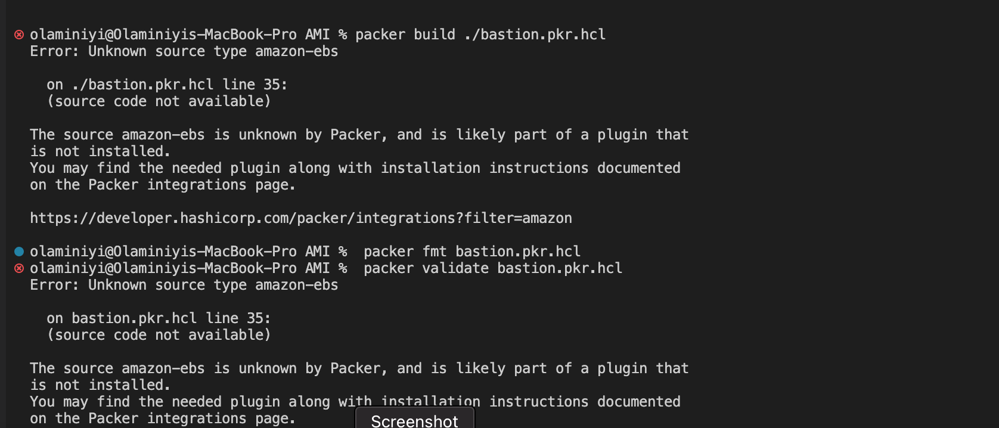
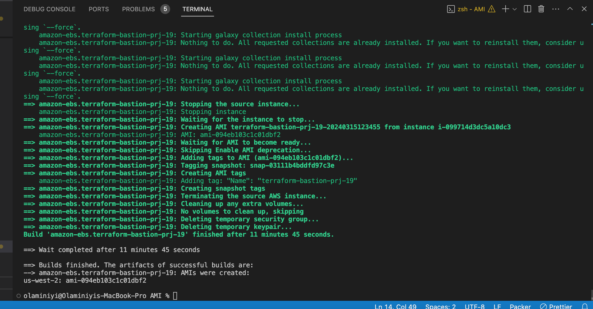
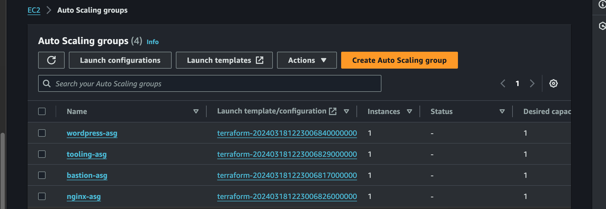
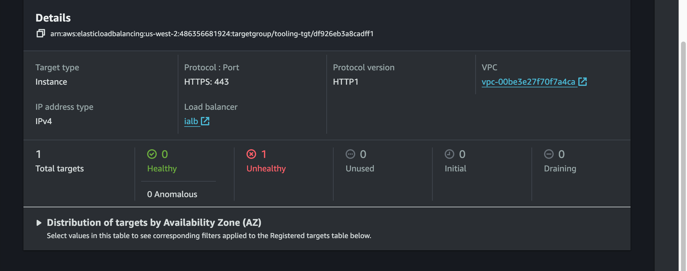
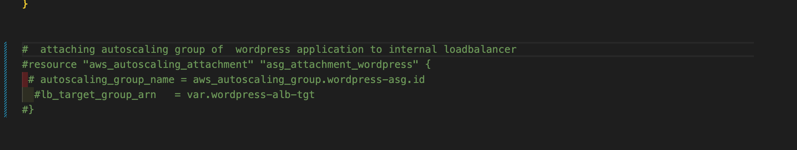
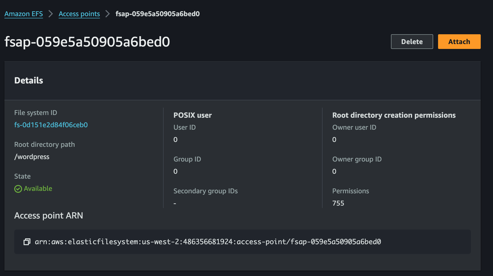

# Automate Infrastructure With IaC using Terraform. Part 4 – Terraform Cloud

# Packer is a server templating tools, could still be count as infrastructure as code
# we will be using dynamic inventory will help us to pull the ip addresses of the aws instances and give it to our ansible 
# aws must have been configured in 17 with the access key and secret
# install packer
# install ansible

# We create a repository from terraform files we created in project 17
# additional to this folder, we will include Ansible module and AMI module
# the AMI module contains packer configuration for creating our AMIs
# 
- Let us explore how we can migrate our codes to Terraform Cloud and manage our AWS infrastructure from there:
       1. Create a Terraform Cloud account
       
       2. Create an organization
            Select "Start with a blank state", choose a name for your organization and create it.
            
            
        3. Configure a workspace . on the project and workspaces
        - click on create a workspace
        We will use version control workflow as the most common and recommended way to run Terraform commands triggered from our git repository.
        Create a new repository in your GitLab and call it PBL_project-19, push your Terraform codes developed in the previous projects to the repository.
        
        4. click on version control workflow
        
        5. under connect to VCS choose GitLab (use can use Github if you want)
        

        6. setup prodiver
            - click on the register a new OAuth Application link: it will take you to the VSC you chose (Github,GitLab or any)
            
            - enter the corresponding details as shown on the page and click Next
            
            - click continue
            

        7. under set up provider 
           enter the details in the "Application: Terraform cloud(Olami)" page into the corresponding field
        
        
        > click Next
        
        8. skip set up ssh keypair
        

        9. under chose repository : chose PBL-project-19
        
        
        10. Give the workspace a name and desription
         
        
        11. under VCS trigger : make sure "always trigger run" and "automatic speculative plan" are selected
        
         > click Next
        12. Configuration upload success
         
         

# Configure variables
Terraform Cloud supports two types of variables: environment variables and Terraform variables. Either type can be marked as sensitive, which prevents them from being displayed in the Terraform Cloud web UI and makes them write-only
- click on variables on the side bar menu 
    
- click add variable : it shows Terraform variable which makes use of the terraform auto.tfvars; and 
  Environment variable which makes use of secret and access keys.
  we can load our terraform auto.tfvars in the terraform variable but it can pick it automaticall from our project if we named the file(terraform.auto.tfvars)

- Set two environment variables: AWS_ACCESS_KEY_ID and AWS_SECRET_ACCESS_KEY, set the values that you created for terraform

# lets start building images
    - go to the directory you have the packer file i.e PBL 19
        - packer init . 
# if we have only 1 packer file in the folder, if it's more than it will throw error of duplicate. you can leave it and go to the next step
        # we want to build bastion first
        - packer build .\bastion.pkr.hcl
    - it was giving this error
   
# I resolved it by running this command : packer plugins install github.com/hashicorp/amazon
   - i encountered another error
   
# i resolved it by changing the RHEL to RHEL-8.6.0_HVM-20220503-x86_64-2-Hourly2-GP2
# i encountered another error that the subnet was not specified
# i change the region from eu-west-2 to us-west-2

    - packer build for nginx

    - packer build for web
 

    - packer build for ubuntu
    - i encountered this error when building the ubuntu AMI

    - I was able to resolve it by changing the ami to this: 
    "ubuntu/images/hvm-ssd/ubuntu-focal-20.04-amd64-server-20240228"
    owners      = ["099720109477"]
    

- All the AMIs after created successfully

# The next step is to copy the ami id and put them accordingly in our terrafor.auto.tvars
- go to the aws console > click on AMI > select each AMi and copy the AMI id
- go to the terraform.auto.tvars and paste the copied AMIs

- commit the changes and push it to the repo

# I encountered this errors

- The error was as a result of case sensitivity of the terraform cloud for the AWS access ID and Key
- i deleted it and added it again in captital letter

# The next step is to check the plan carry out plan and apply just like using terraform on our local machine
    - go to to terraform cloud workspace of your project
    - from the side menu, click on RUN
    - if their is no any "run" going on
    - click on New run > Start
    

    - the "run" created a successful plan
    

    - scrow down and click on "confirm & apply"
    

- i encountered this error

- I checked the IAM console on the AWS, i checked under the roles and found that "ec2-instance-role" exist. This is as a result of my previous projects bearing the same name
-  I deleted it 

- I created another run and apply to create the remaining resources and ran into another error
    

- I checked under the IAM console but it was not showing. I learnt that this type can persist on a system without showing under the IAM role
- I used this command to check for the list of profiles on my AWS account
     aws iam list-instance-profiles
- it shows the profile exist
- deleted it with this command 
    aws iam delete-instance-profile --instance-profile-name aws_instance_profile_test  
    

- I created another run and apply and it was succesful

- check the resources if they are created successfully on the AWS

- checking our target gropus, i expect them to fail health check because they have not been configured the instances like: installing apache, fixing the path for the health check 

- There are 2 ways to do it, we can either deregisterd the target group or do it in the terraform code
- The first to do is to remove those instance as listener to the load balancer. This is because the target group as been designed as a listener to the load balancer and as a result of it the load balancer will forward traffick to them.
So we are going to comment them out first from our code

- secondly, we will go into the autoscaling group, we know the autoscalling group are attach to the load balancer. so that the autoscaling group will not spin up another EC2 instance, so we are going to comment out the autoscalling group attachmnet for (nginx, wordpress and tooling)

- commit the changes and push to git

# The next step is to update the ansible script with values from terraform output
    - RDS endpoints for wordpress and tooling
    - Database name, password and username for tooling and wordpress
    - Access points ID for tooling and wordpress
    - internal load balancer DNS for nginx reverse proxy

- to achieve the step listed above, we login to our bastion host, clone done the ansible script and make our changes.
    - add the pem key to your terminal
    

    - go to instances on AWS console and copy the public ip of the baston
    - add it to the remote ssh configuration on the vscode
    
    
    - ssh to the bastion server
    - to confirm that our forward agent works ; open a terminal and type this command
        ssh-add -l
        
    - by default because we have added our keypair to the keychain, the ssh agent bring it into the server but does not store it on the server

    - from our AMI we installed AWS CLI, let check if it was installed with this command
        aws
    - it was installed
    

    - clone ansible folder from gitlab
        git clone https://gitlab.com/olaiyaolaminiyi/ansible-deploy-pbl-19.git

    - Ansible is going to need to connect to our AWS account to pull the private ip addresses of the instances that was we used the dynamic inventory inside the "aws_ec2.yml"
    - so we need to give ansible our secret and access key also
    - so we do aws configure also on our bastion and set the access and secret key
    

    - let's test it by checking for the s3 on the AWS
        

 # copy the rds endpoint for wordpress and tooling
    - go to the RDS on the AWS console
    - click on databases > click on terraform created database
    copy the RDS endpoint

- go to the ansible file > roles > tooling > tasks > setup-db.yml
- update the terraform endpoint in the creating database task and Input tooling credentials task with: 
    terraform-20240317221301736400000009.cr2aami6gg0r.us-west-2.rds.amazonaws.com

 go to the ansible file > roles > wordpress > tasks > setup-db.yml
- update the terraform endpoint in the creating database task and Input wordpress credentials task with: 
    terraform-20240317221301736400000009.cr2aami6gg0r.us-west-2.rds.amazonaws.com

# copy the DNS name for the internal load balancer
- go to load balancer > select the ialb(internal load balance)
- copy the DNS name

- go to the ansible file > roles > nginx > template > nginx.confi.j2
- update the dns name for the load balancer

# The next step is to update file system ID and Access points ID for tooling and wordpress

- go to EFS on AWS console > access point
- click on the wordpress > click attach 

-  copy the fsap part first

- go to the ansible file > roles > tooling > tasks > main.yml 
    - paste it to replace fsap part for opts
    

- copy the fs part and replace it with the src part

- go to the ansible file > roles > wordpress > tasks > main.yml 

- we do the same thing for the wordpress

# install some required application on bastion

sudo dnf install python3-devel

curl https://bootstrap.pypa.io/get-pip.py -o get-pip.py

sudo python3.11 get-pip.py
 
pip install botocore boto3

# update the ansible.cfg roles path
- open the ansible.cfg
- copy the path of the role and update the roles path

- then copy and export the Ansible.cfg path for ansible to look at the path when running
    - export ANSIBLE_CONFIG=/home/ec2-user/ansible-deploy-pbl-19/ansible.cfg

# The next step is to run the ansible playbook to configure the instances
    - we need to run the ansible inventory first to check if the dynamic inventory will be able to fetch our private IP addresses
        ansible-inventory -i inventory/aws_ec2.yml --graph

    - we can run our ansible playbook now
        ansible-playbook -i inventory/aws_ec2.yml playbooks/site.yml

- ssh into the nginx server from our bastion server to check if it was properly configured
    - check for the nginx status

    - sudo vi /etc/nginx/nginx.conf

- ssh into the tooling server from our bastion server to check if it was properly configured
     - check if it was successfull mounted
        df -h

    - check if server is running
        sudo systemctl status httpd 

    - change to html
     cd /var/www/html
     ls

    - check if the website is running locally
    curl localhost

    - ssh into the wordpress server from our bastion server to check if it was properly configured
     - check if it was successfull mounted
        df -h

    - check if server is running
        sudo systemctl status httpd 

    - change to html
     cd /var/www/html
     ls

    - check if the website is running locally
    curl -v localhost

    - There is an error with the database connection for wordpress
    - configure it
        sudo vi wp-config.php
    
    - ansible did not input the database name, username and password and hostname properly

    - hostname is our terraform endpoint

- the website is available locally now

# now that our website are available locally let's go back to the terraform module and update our target group and autoscalling group

export PATH="$PATH:/usr/local/bin"

aws ec2 describe-availability-zones --region $REGION 